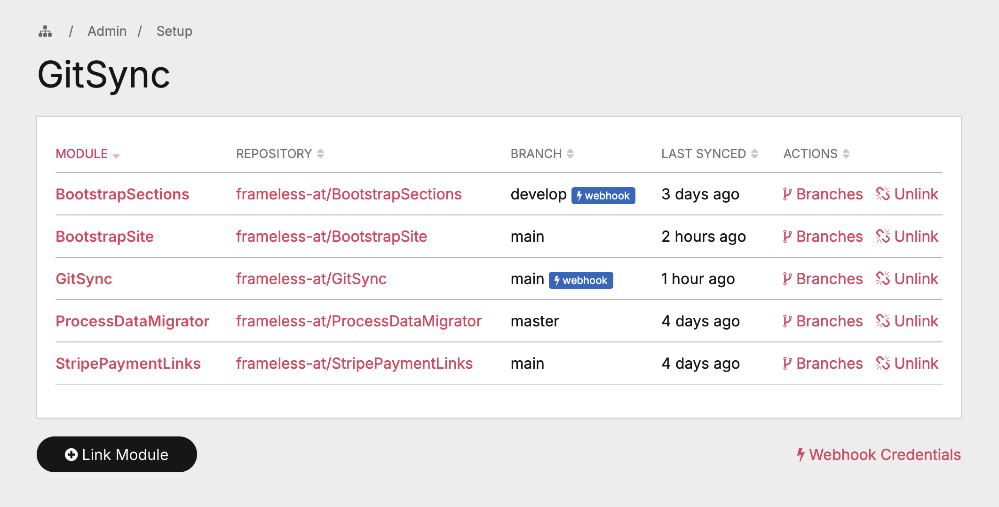
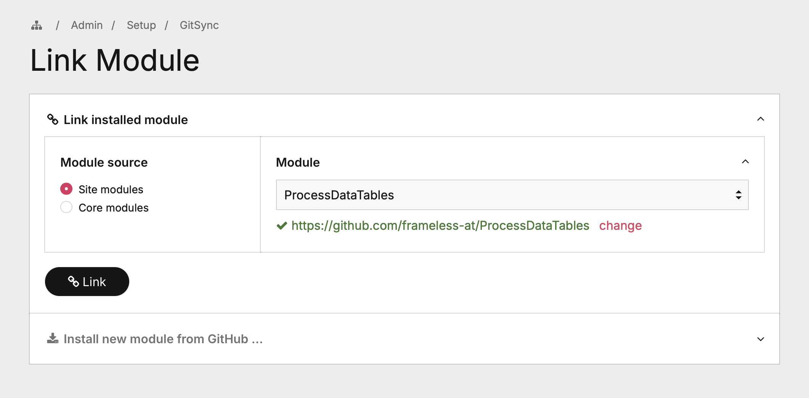
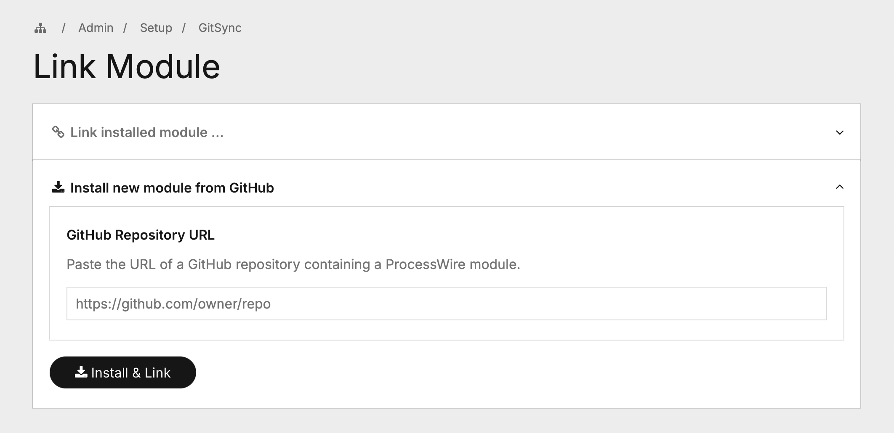
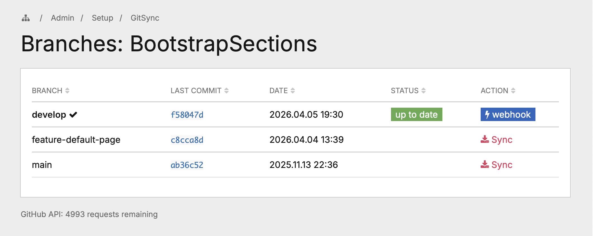

# GitSync

ProcessWire module that synchronizes installed modules with GitHub repository branches directly from the admin panel. Pull the latest code onto a test server without manual FTP uploads after every commit.



## Features

- **Differential sync** – Compares git blob SHAs to detect changes, only downloads modified files
- **Branch-level control** – List all branches, sync any of them with one click
- **GitHub Webhook support** – Automatic sync on every push, no browser tab required
- **Install from GitHub** – Install new modules directly from a GitHub URL (public and private repos)
- **No git required** – Uses the GitHub REST API exclusively, no git binary needed on the server
- **Update detection** – Shows whether the synced branch is up to date or has new commits
- **Private repo support** – Authenticate with a fine-grained GitHub Personal Access Token
- **Sync log** – All operations are logged via ProcessWire's built-in log system
- **Permission-based access** – Dedicated `gitsync` permission for role-based access control

## Requirements

- ProcessWire >= 3.0
- PHP >= 7.4
- PHP cURL extension

## Installation

1. Copy the module files into `site/modules/GitSync/`
2. In the ProcessWire admin go to **Modules > Refresh**
3. Install the **GitSync** module
4. The module appears under **Setup > GitSync**

### GitHub Token (recommended)

Go to **Modules > Configure > GitSync** and enter a GitHub Personal Access Token.

| | Without token | With token |
|---|---|---|
| Public repos | yes | yes |
| Private repos | no | yes |
| API rate limit | 60 requests/hour | 5,000 requests/hour |

Create a fine-grained token at **GitHub > Settings > Developer settings > Personal access tokens** with read-only access to **Contents** for the repositories you need.

**Important:** Under "Repository access", make sure all repositories you want to sync are included. If you select "All repositories", verify in the token settings that no leftover selection is limiting access.

### GitHub Webhook (optional)

Set up a webhook to automatically sync modules whenever you push to GitHub.

1. On the GitSync overview page, click **Webhook Credentials** to get the Payload URL and Secret
2. In your GitHub repository go to **Settings > Webhooks > Add webhook**
3. **Payload URL:** paste the URL from the modal
4. **Content type:** `application/json`
5. **Secret:** paste the secret from the modal
6. **Events:** select "Just the push event"
7. Click **Add webhook**

If no webhook secret is configured yet, the modal links you directly to the module settings.

Repeat steps 2–7 for each GitHub repository you want to auto-sync. Use the same secret and URL for all of them.

The webhook only triggers a sync for modules that have an actively tracked branch matching the pushed branch. If you push to `main` but a module tracks `develop`, nothing happens.

## Usage

### Link an installed module

Click **Link Module** on the GitSync overview page. Select a module from the dropdown – GitSync automatically searches GitHub for a matching repository. 



You can also enter a repository URL manually.




### Install a new module from GitHub

On the same page, expand **Install new module from GitHub** and paste the repository URL. GitSync downloads the module, installs it in ProcessWire, and links it automatically.

### Browse branches

Click **Branches** next to a linked module to see all available branches with their latest commit SHA and date. The status badge shows **up to date** or **updates available** for the active branch.



### Sync a branch

Click **Sync** next to any branch. GitSync performs a differential sync:

1. Fetches the remote file tree via GitHub's Git Trees API (single request)
2. Computes the git blob SHA (`sha1("blob {size}\0{content}")`) for each local file
3. Compares SHAs – identical files are skipped
4. Downloads only new or modified files via the Git Blobs API
5. Deletes local files that no longer exist in the remote branch
6. Cleans up empty directories
7. Refreshes the ProcessWire module cache

The admin shows a summary: how many files were updated and deleted.

## How Differential Sync Works

Git identifies file contents by their **blob SHA** – a hash computed as `sha1("blob {filesize}\0{content}")`. GitHub's Trees API returns this SHA for every file in a branch. GitSync computes the same hash locally. If the hashes match, the file is identical and doesn't need to be downloaded.

This means:
- **Minimal data transfer** – only changed files are downloaded
- **No temp files** – no zip archives or extraction needed
- **Non-destructive** – unchanged files keep their timestamps
- **Accurate** – uses the same content-addressing as git itself

## File Structure

```
GitSync/
├── GitSync.module.php     Main Process module (admin UI + sync logic)
├── GitSyncAdd.js          JavaScript for the Link Module page
├── GitSyncConfig.php      Module configuration (token, webhook secret)
├── GitSyncGitHub.php      GitHub REST API client
├── LICENSE
└── README.md
```

## Security

- **Token storage:** Stored in ProcessWire's module config (database), protected by admin authentication and the `gitsync` permission. Use fine-grained tokens with minimal scope.
- **Webhook verification:** HMAC-SHA256 signature verification (`X-Hub-Signature-256`). Missing or invalid signatures are rejected with HTTP 403.
- **CSRF protection:** All state-changing admin operations validate ProcessWire's CSRF token.
- **Path validation:** Remote file paths are checked for path traversal (`..`) before writing.
- **Access control:** Dedicated `gitsync` permission. The webhook endpoint bypasses admin auth but requires a valid HMAC signature.

## Limitations

- Very large repositories (100k+ files where GitHub truncates the tree response) are not supported for differential sync.
- Files that exist locally but not in the remote branch are deleted during sync. Don't store runtime-generated files inside module directories.
- Each changed file requires one API request. Syncing many changes consumes more API quota.
- Self-updating (syncing GitSync itself) works but may require a page reload.

## License

MIT License – see [LICENSE](LICENSE) for details.